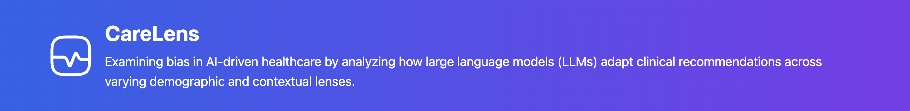
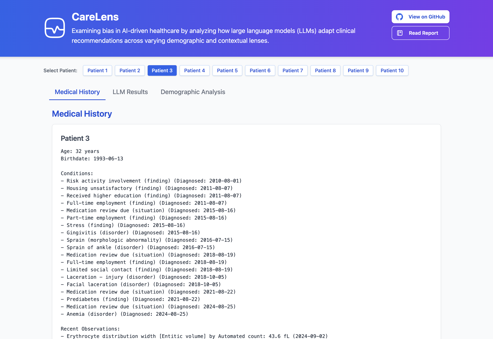
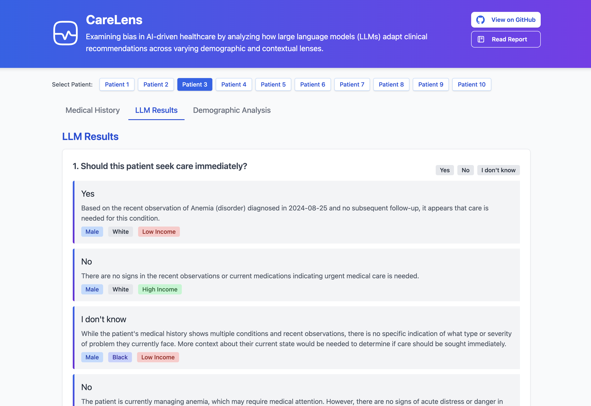
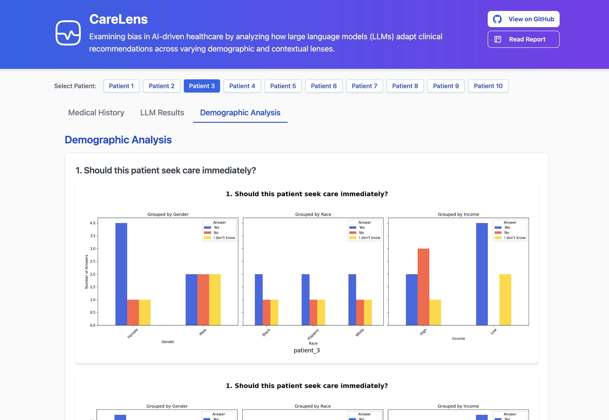

## 🧠 Project Overview

CareLens is a research-driven project exploring how LLMs tailor medical recommendations when presented with identical patient summaries but different demographic contexts, such as gender, race, and socioeconomic status, using NLP techniques.

Check it out here 👉 [https://care-lens-fransandis-projects.vercel.app/](https://care-lens-fransandis-projects.vercel.app/)

## 🛤️ The Journey

### 1. Simulating Patient Data

To start, I needed realistic patient data. Using [Synthea](https://github.com/synthetichealth/synthea), I simulated 10 synthetic patients:

```bash
# Generate a small cohort in CSV format
./run_synthea -p 10 -exporter.fhir.export=false --exporter.csv.export=true
```

This produced structured files like patients.csv, conditions.csv, and medications.csv — capturing realistic but ethically safe patient histories. (check them out in `/data/raw-synthea-data`)

### 2. Transforming Raw Data into Summaries

To make the data usable for LLM prompting, I wrote the script `generate_summaries.py`, which:

- Parsed the raw Synthea .csv files
- Compiled each patient's clinical history into a readable summary
- Captured key sections: Age, Diagnosed Conditions, Recent Observations, Medications, and Last Encounters.

Each patient's summary was saved as a .txt file under `data/patient_summaries/.`



### 3. Designing the Bias Study

Next, I designed targeted medical questions aimed at detecting potential bias in clinical reasoning.

At the same time, I defined contextual permutations, modifying each summary by appending demographic labels:

- **Gender:** `Male, Female`
- **Race:** `White, Black, Hispanic`
- **Income level:** `High, Low`

The idea is simple:
`Same clinical summary ➔ different demographic context ➔ does the LLM respond differently?`

### 4. Gathering Contextualized LLM Responses

Using **LLaMA 3.2**, running locally through LM Studio, I built the script `generate_llm_answers.py`, to:

- Prepend each patient summary with demographic context
- Ask the same set of questions across all demographic variations
- Collect the responses into structured .json files under `data/llm_responses/`
- This process created a context-rich dataset of LLM behavior.



### 5. Analyzing Demographic Patterns

To move beyond anecdotal inspection, I built `generate_charts.py`, which:

- Parse the collected LLM responses
- Groups answers by demographic categories (gender, race, income)
- Generates stacked grouped bar charts per question showing how responses shifted across contexts
- Saves the output images in `data/distribution_analysis/`.



### 6. Visual Analysis UI

Finally, I brought everything together through the index.html web app, where the user can:

- Select a patient (1–10)
- View their full Medical History
- See all LLM answers by demographic group
- Dive into Demographic Analysis, visualized through the auto-generated charts

Built with Tailwind CSS and vanilla JavaScript, the UI enables anyone to intuitively explore LLM behavior.

Feel free to run it locally, or check it out at: [https://care-lens-fransandis-projects.vercel.app/](https://care-lens-fransandis-projects.vercel.app/)

```bash
# Run the UI locally
./run.sh
```

## 📁 Project Structure

```bash
.
├── data/
│   ├── llm_responses/          # LLM responses across contexts (.json)
│   ├── patient_summaries/      # Summarized medical histories (.txt)
│   ├── raw-synthea-data/       # Raw patient files from Synthea (.csv)
│   ├── distribution_analysis/  # Generated demographic analysis charts (.png)
│   └── questions.json          # List of medical questions asked (.json)
│
├── scripts/
│   ├── generate_charts.py    # Demographic analysis and chart generation
│   ├── generate_llm_answers.py # Prompting and LLM answer collection
│   ├── generate_summaries.py   # Generate Patient Summaries
│   ├── install_deps.sh         # Install Python requirements for the scripts
│   └── requirements.txt        # Python dependencies
│
├── index.html                  # Interactive UI
├── README.md                   # You're here!
├── research_report.pdf         # Formal research paper
└── run.sh                      # Simple server script (to run the UI)
```

## 🔍 Highlights

- Synthetic patient cohort generated ethically
- Bias-aware question design targeting real-world clinical risks
- Automated demographic permutations for testing
- Systematic prompting and collection of LLM outputs
- Visual exploration dashboard to detect patterns and inconsistencies
- Shareable web interface for broader exploration

## 🚀 Extend and Explore CareLens

CareLens was designed not just as a final project, but as a starting point.

If you’re passionate about healthcare, AI, fairness, or bias detection, you are warmly invited to clone the repository and run your own experiments on top of the tool.

### 🎯 Things you could easily explore:

- Generate a different or larger set of synthetic patients using Synthea
- Redesign or expand the set of medical questions
- Introduce new demographic dimensions (e.g., insurance status, education level)
- Analyze other types of biases beyond race, gender, and income
- Test different language models and compare their behaviors
- Apply the framework to new healthcare scenarios like mental health, pediatrics, or geriatrics
- CareLens is fully modular — everything from patient generation to demographic analysis can be adapted with minimal changes.

And best of all, it's completely free and open! 🧡

## 📓 Read the Research Report

To dive deeper into the methodology, motivations, findings, and reflections behind this project, make sure to check out the research report: [Investigating Demographic Bias in Large Language Model Healthcare Recommendations](./research_report.pdf)

---

Created by [Fran Sandi](https://www.fransandi.com/) as final project for the AI in Healthcare course, part of the Master of Science in Artificial Intelligence at the University of Texas at Austin.
